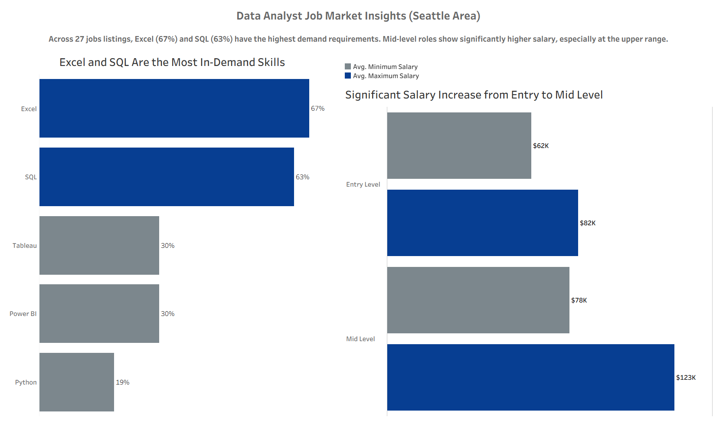

# Data Analyst Job Market Analysis (Seattle Area)

Insights on manually collected job postings, identifying highest in-demand skills and salary trends using Excel and Tableau.

## Overview
This project analyzes 27 data analyst job postings to identify the most in-demand skills and salary trends across role levels.

## Tools Used
- Python (data cleaning and skill extraction from job descriptions)
- Excel (data aggregation)
- Tableau (data visualization)

## Key Insights
- Excel (67%) and SQL (63%) are the most in-demand skills across job postings.
- Tableau and Power BI appear in 30%, while Python is less common at 19%.
- Mid-level roles command significantly higher salaries than entry-level roles.
- Maximum salaries increase by over $40K from entry to mid-level positions.

## Dashboard

## Takeaway
Thes findings suggest for aspiring data analysts that prioritizing SQL and Excel provide a strong foundation for entry-level roles, while broadening skills supports long-term growth.
